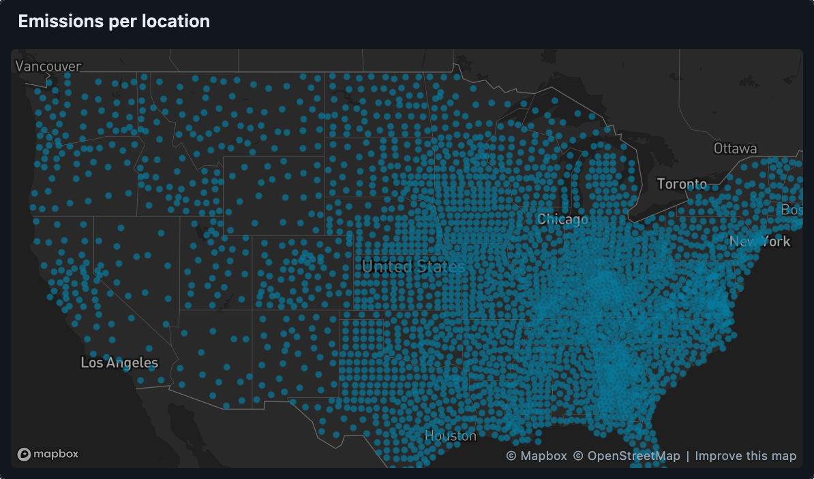
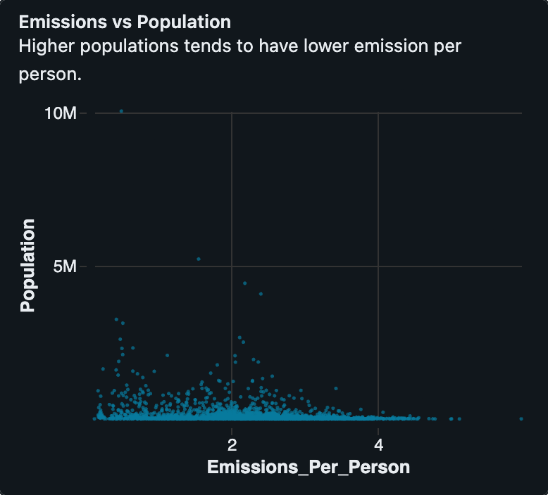
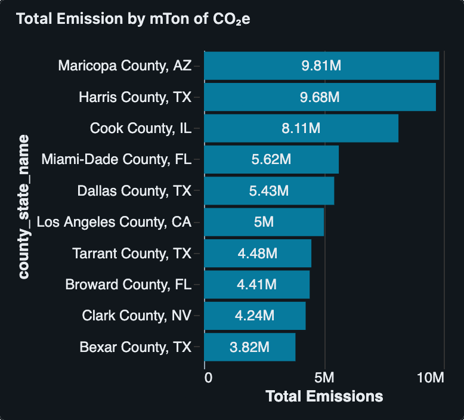
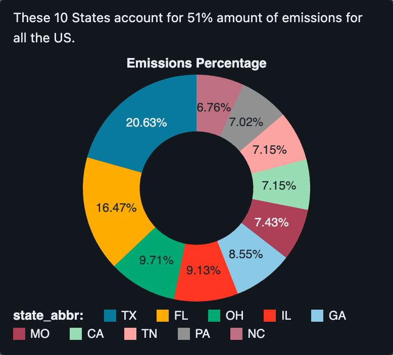

# US County Emissions Analysis

Analyzed greenhouse-gas emissions across ~3,000 US counties using **Databricks SQL** on top of **Delta Lake** tables, and built an interactive **Databricks Dashboard** surfacing both per-capita and absolute emissions leaders.

---

## Tools

- **Databricks** (Free Edition) — Serverless SQL Warehouse, Catalog Explorer, Dashboards
- **SQL** — aggregations (`SUM`, `GROUP BY`), type casting, safe-division
- **Delta Lake** — underlying storage format for the `emissions.default.emissions_data` table

---

## Dashboard

Full exported dashboard: [`dashboard/emissions_dashboard.pdf`](dashboard/emissions_dashboard.pdf)

### 1. Emissions per Location (geo map)
Every county plotted by lat/long, bubble size = emissions volume.


### 2. Emissions vs Population (per-capita outliers)
Per-capita emissions ranking. Top counties skew small + rural.


### 3. Total Emissions by State (top 10)
State-level rollup of total mtons CO₂e.


### 4. County Shaming (top 10 absolute emitters)
Largest absolute emitters — dominated by dense urban counties (Maricopa AZ, Harris TX, Cook IL).


---

## Key findings

- **Per-capita vs absolute tell different stories.** Top per-capita emitters are tiny rural counties (e.g., Thayer County, NE ≈ 5.94 mtons CO₂e/person); top absolute emitters are large urban counties (Maricopa AZ ≈ 9.8M mtons CO₂e total).
- **State totals are skewed.** Texas and Florida lead absolute state totals, driven by a small number of high-population counties rather than uniformly high emissions across the state.

---

## Data quality handling

The raw `GHG emissions mtons CO2e` column ships as a **string with thousand-separators** (e.g., `"1,234,567"`), and some counties have **zero or missing population**. Both would crash naïve queries. The pipeline handles them with:

```sql
CAST(REPLACE(`GHG emissions mtons CO2e`, ',', '') AS DOUBLE)
    / NULLIF(CAST(population AS DOUBLE), 0)
```

- `REPLACE(..., ',', '')` — strip commas so the string parses as a number
- `CAST(... AS DOUBLE)` — convert to numeric
- `NULLIF(population, 0)` — return `NULL` instead of dividing by zero

---

## Files

```
data/Emissions_Data_2023.csv      -- raw input dataset (~3k US counties, 2023)

queries/                          -- SQL powering each dashboard dataset
├── 01_location_data.sql          -- geo-map source
├── 02_emissions_per_person.sql   -- per-capita ranking
├── 03_total_emissions_per_state.sql  -- state-level rollup
└── 04_county_shaming.sql         -- top-10 absolute emitters

screenshots/                      -- chart exports from the dashboard
dashboard/emissions_dashboard.pdf -- full dashboard PDF export
```

## Dataset

`data/Emissions_Data_2023.csv` — one row per US county with state/county identifiers, coordinates, population, and energy/emissions metrics. The column of interest, `GHG emissions mtons CO2e`, is stored as a **comma-formatted string** (e.g. `"156,670"`), which is what the `REPLACE(...) + CAST AS DOUBLE` pattern in the queries handles.

---

## How to reproduce

1. Spin up a Databricks workspace (Free Edition works).
2. Upload `data/Emissions_Data_2023.csv` and create a Delta table at `emissions.default.emissions_data`.
3. Start a SQL Warehouse, open each file in `queries/` in the SQL Editor, and run.
4. Build a Dashboard, add each query as a dataset, and attach the visualization type shown in `screenshots/`.
